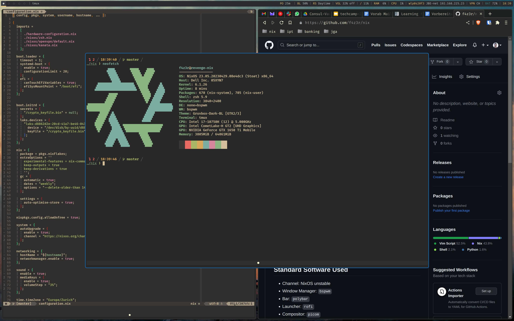
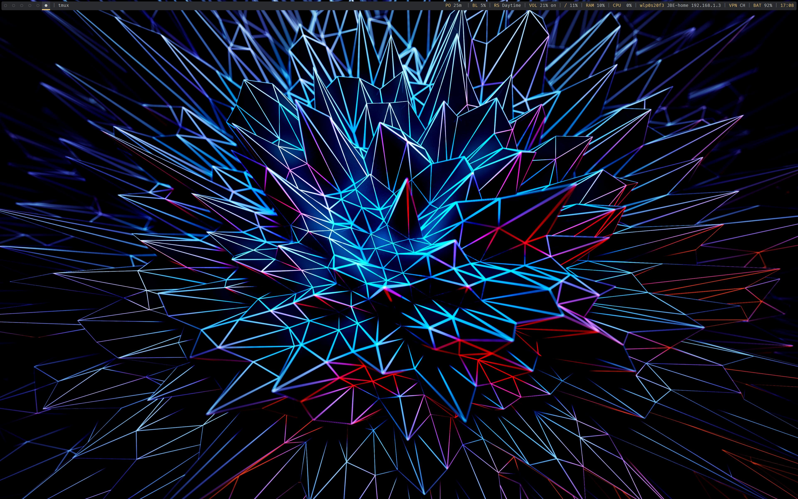
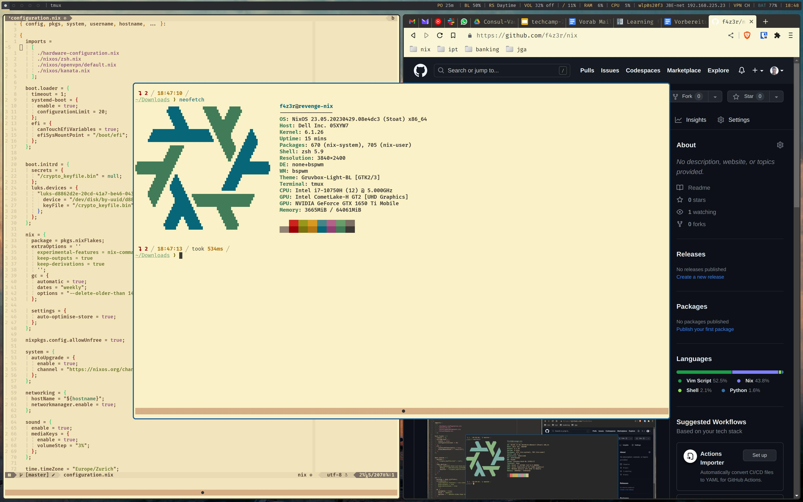

# f4z3r's NixOS Flake

## Screenshots







With the light theme, for working outside in the sun:



## Standard Software Used

- Channel: NixOS unstable
- Window Manager: `bspwm`
- Bar: `polybar`
- Shortcut Daemon: `sxhkd`
- Keyboard Remapper: `kanata`
- Launcher: `rofi`
- Compositor: `picom`
- GTK Theme: `Gruvbox Material Dark`
- Terminal: `wezterm`
- Multiplexer: `tmux`
- Shell: `zsh`
- Editor: `neovim`
- Prompt: `starship`
- Audio: `pipewire`

## Update

```sh
# update channels
sudo nix-channel --update
# update flake lock file
nix flake update
# rebuild system
sudo nixos-rebuild switch --flake .#
```

## Dynamic Theming

Themes cannot be implemented fully dynamically, as Nix's filesystems are read-only. Instead, you can
choose to switch between themes (`dark` or `light`) in `./flake.nix` and rebuild. You will need to
reload the tmux configurations if a tmux instance is already running:

```sh
:source ~/.config/tmux/tmux.conf
```

and export `NIX_THEME="..."` for NeoVim to take over the theme if you do not which to restart
shells. WezTerm will take over the theme dynmically. GTK themes typically reload only on application
restart.

## OpenVPN

Download configurations from Proton to get the CAs, Keys, etc. All VPN information is then stored
under `/root/vpn` to ensure they are not world readable. Store them as:

- `/root/vpn/ca`: Proton's CA, theoretically public
- `/root/vpn/tls-auth`: Proton's TLS key, theoretically not too problematic
- `/root/vpn/jakobbeckmann-proton.cred`: your credentials (with `+f2` attached to the username for
  NetShield protection), with username on first line and password on second.

## ClamAV

ClamAV should be instantiated and installed by default. In order to set up the folder for the
quarantine, run the following:

```sh
sudo mkdir -p /root/quarantine
```
