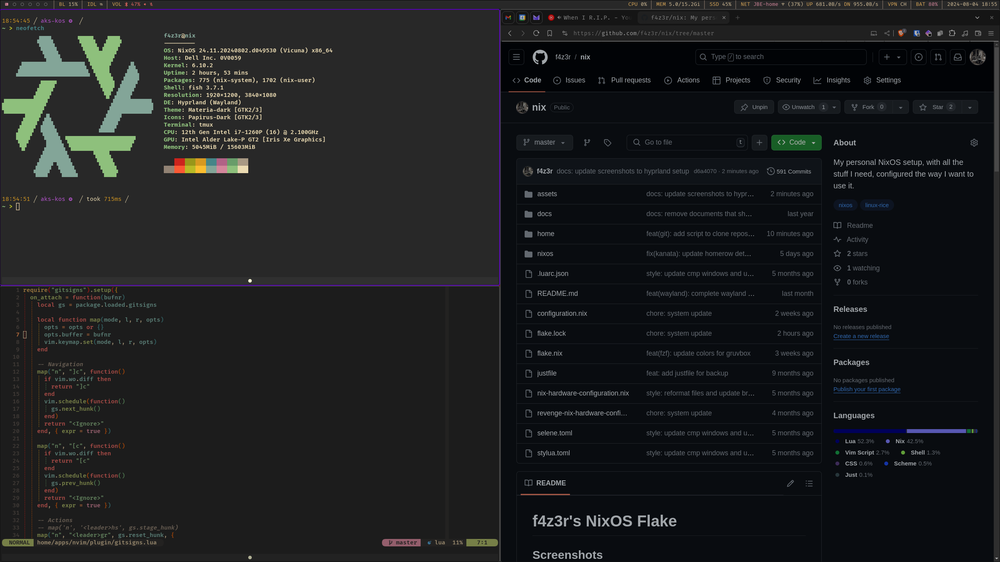

# f4z3r's NixOS Flake

## Screenshots




Supports quake terminals:


## Standard Software Used

- Channel: NixOS unstable
- Package Manager: `lix`
- Window Manager: `hyprland`
- Bar: `waybar`
- Layered Keyboard Mapping: `kanata`
- Launcher: `rofi`
- GTK Theme: `Materia Material Dark`
- GTK Icon Theme: `Papirus Dark`
- Terminal: `foot`
- Multiplexer: `tmux`
- Shell: `fish`
- Editor: `neovim`
- Prompt: `starship`
- Audio: `pipewire`, `mpd`, `ncmpcpp`

## Update

```sh
# update channels
sudo nix-channel --update
# update flake lock file
nix flake update
# rebuild system (impure needed due to external credentials for rclone)
sudo nixos-rebuild switch --impure --flake .#
```

## Dynamic Theming

Themes cannot be implemented fully dynamically, as Nix's filesystems are read-only. Instead, you can
choose to switch between themes (`dark` or `light`) in `./flake.nix` and rebuild. You will need to
reload the tmux configurations if a tmux instance is already running:

```sh
:source ~/.config/tmux/tmux.conf
```

and export `NIX_THEME="..."` for NeoVim to take over the theme if you do not which to restart
shells. Foot will take over the theme dynmically. GTK themes typically reload only on application
restart.

## Bootstrap New Computer

See [`docs/bootstrap.md`](./docs/bootstrap.md).

## ClamAV

ClamAV should be instantiated and installed by default. In order to set up the folder for the
quarantine, run the following:

```sh
sudo mkdir -p /root/quarantine
# needed to run once or the service will fail
sudo freshclam
```

## FireNvim

In order to overlay a NeoVim window in a browser, we are using firenvim. In order to get this to
work, you need to install the firenvim extension in your browser and run `nvim --headless "+call
firenvim#install(0) | q"` once.

## Secrets

Download the `secrets.nix` file from the encrypted storage. We do not use the standard way to add
secrets to the staging area without committing them, as it is a pain when pulling changes from other
machines. It is still documented here for completeness. A git hook will prevent committing the
`secerts.nix` file either way.

```bash
git add -N secrets.nix
git update-index --assume-unchanged secrets.nix
```

> [!NOTE]
> If encountering issues when pulling, it might make sense to run:
>
> ```bash
> git update-index --really-refresh
> ```
>
> and continue from there.

## Restic

Configure a `rclone` backend named `gdrive`. Store the `rclone` configuration under:

```bash
# can be found on proton drive
# ! do not use the same config as for sb sync actions, as that one is encrypted for additional
# protection !
/etc/nixos/rclone.conf
```

## Rclone

Rclone is setup to sync the second brain between devices with an alias. In order to allow a simple
sync without having to trust google to not eavesdrop, all files within the second brain are passed
via the `crypt` encryption layer from Rclone before syncing. Both encryption and salt are protected
by 512bit passphrases. The encrypted configuration can be found in the proton drive.

```bash
# copy from the proton drive to local and change premissions
sudo chmod 600 ~/.config/rclone/rclone.conf
# check that there are at least the following backends configured:
# - gdrive (used by restic directly, restic does encryption as well)
# - gdrive-crypt (used by to sync the second brain between devices, with rclone encryption layer)
rclone config
```

Once this is done, you can perform an initial sync using:

```bash
# you can also run with --dry-run first to check if the output matches your expectations
rclone bisync gdrive-crypt:/ ~/notes --create-empty-src-dirs --compare size,modtime -MP --fix-case --resync
```

After which you can use `ns` to sync notes.

## Static Configuration

This repository also offers some static configurations for environments where a basic shell is
needed to work. These can be found under [`./static-configs/`](./static-configs/).

## Technical Debt

- Check how to notify on virus event.
- Various nvim plugins are my own forks awaiting merging in the upstream.
- Various nvim plugins are pinned to a version, and might want to be updated.
- Rofi colours are not dynamic for system theme.
- Foot copy output does not work when run within Tmux.
